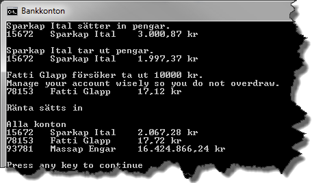
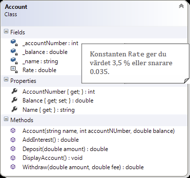

# Bankkonton

## Problem

Till denna övningsuppgift medföljer ett projekt där en klass, ```Account```, saknas. Klassen ```Program``` och dess ```Main```-metod finns redan definierad. Din uppgift är att skriva en klassdeklaration för den saknade klassen, så att koden i ```Main``` kan köras utan problem och ger en utskrift enligt bilden nedan.



Figur 1. Konsollutskrift efter att klassen Account har implementerats korrekt.

**OBS! Du får inte ändra på någon kod i Main-metoden och ingen ny kod får läggas till i klassen Program.** Studera klassdiagrammet (Figur 2.), titta på skärmdumpen (Figur 1) och läs koden i ```Main```-metoden i det bilagda projektet, för att lista ut vad klassen ```Account``` ska innehålla.
(Kod ska alltid kommenteras, men i detta fall är det med avsikt som det inte finns några kommentarer. Du ska kunna förstå det du behöver av koden ändå.)

##### Klassen Account

```Account```-klassen representerar ett enkelt bankkonto. Klassen innehåller fält som representerar bankkontots ägare, nummer och saldo. Räntan lagras i en symbolisk konstant, ```Rate```.



Figur 2. Klassdiagram över klassen Account

**Fält (Fields)**<br/>
Klassen ```Account``` har en konstruktor som tar tre parametrar, vilka används till att initiera fälten ```_accountNumber```, ```_balance``` och ```_name``` då ett nytt objekt instansieras av klassen.

**Egenskaper (Properties)**<br/>
De båda egenskaperna ```AccountNumber``` och ```Name``` tillhandahåller enbart en publik ```get```-metod vardera. Egenskapen ```Balance```, som både har en ```get```- och en ```set```-metod, är kopplad till fältet ```_balance``` men det är bara get-metoden som ska vara publik; ```set```-metoden ska vara privat.  

**Metoder (Methods)**<br/>
Klassens övriga metoder är publika och används för att göra olika saker som att sätta in och ta ut pengar. Innan en metod får modifiera saldot (```_balance```) måste den undersöka datat som skickas in till metoden så att en transaktion kan utföras korrekt. Exempelvis måste metoden ```Withdraw()``` hindra alla försök till ett negativt uttag (som ju då skulle bli en insättning).

_AddInterest_<br/>
Du anropar ```AddInterest()``` för att lägga till ränta till bankkontot. Multiplicera saldot med räntan och addera resultatet av multiplikationen (produkten) till saldot.

_Deposit_<br/>
För att sätta in pengar på kontot anropar du metoden ```Deposit()```. Du måste kontrollera att beloppet som ska sättas in verkligen är större än 0. Är det inte större än 0 kastar du ett undantag med meddelandet _"The amount can not be less than 0."_.

_DisplayAccount_<br/>
Då du vill presentera ett bankonto anropar du metoden ```DisplayAccount()```. Bankkontonummer, innehavarens namn samt saldot ska presenteras. Använd tabbtecken (```\t```) för att separera de olika värdena åt. För att presentera ett tal som en valuta använder du dig av formatspecificeraren ```c```, t.ex. ```{0:c}```.

_Withdraw_<br/>
För att ta ut pengar från bankkontot anropar du metoden ```Withdraw()```. Du måste förvissa dig om att det finns pengar på kontot så att de räcker både till uttaget och till avgiften för uttaget innan uttaget genomförs. Saknas pengar kastar du ett undantag med meddelandet _"Manage your account wisely so you do not overdraw."_.

## Mål

Efter att ha gjort uppgiften ska du:

- Veta hur du skapar objekt och initierar ett objekts fält med hjälp av en konstruktor.
- Känna till att egenskapers ```get```- och ```set```-metoder kan vara en mix av ```public``` och ```private```.
- Kunna använda en privat symbolisk konstant i en klass.

## Tips

Läs om:

+ Grunderna om klasser och objekt hittar du i inledningen av kapitel 5, som bl.a. tar upp saker som konstruktorer (_constructors_), accessmodifierare (_access modifiers_), fält (_fields_) och egenskaper (_properties_).
+ Konstant som fält i kurslitteraturen, kapitel 5, under rubriken _”Encapsulating the Data”_.
+ Grunderna i hur du kastar undantag hittar du i inledningen av kapitel 10.

[Lösning](solution/README.md)